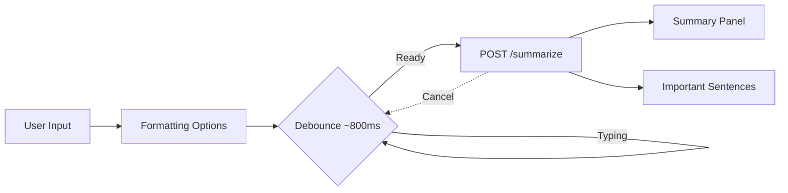

# PrimeSummarizer Frontend

PrimeSummarizer is a premium AI text-summarizing frontend built with pure HTML/CSS/JS. This document fully describes the current behavior of the UI, the automatic processing feature, and the deprecations that were introduced by removing price selection and manual processing.

Overview
- Modern minimal design with black/dark-gray palette and white accents.
- Responsive layout for desktop and mobile.
- Accessible interactions with clear feedback and non-blocking processing.
- No frameworks; optimized, lightweight assets.

 Deprecated Features
- Pricing selection and the entire pricing section are removed from the UI. Any references to selecting plans or viewing pricing tiers are deprecated.
- Manual "Summarize" button is removed. Summaries now start automatically when users provide input.

Automatic Processing
- Automatic summarization begins after the user types or pastes text into the input area.
- Debounced trigger ensures requests start only when typing pauses (~800ms) and input is at least 5 characters.
- Ongoing requests are cancelled when new input is detected; the UI displays an inline loader and offers a Cancel button.
- Error messages are surfaced clearly when API calls fail.

How It Works
- Formatting options can normalize whitespace, line breaks, and trimming before sending input to the API.
- A cancellable request is made to the backend endpoint with JSON payload `{ "text": "USER_INPUT_TEXT" }`.
- The response is parsed into two panels: a summary and important sentences.

 Active Frontend Features
- Hero section with brand logo and tagline.
- Product description with a visual process representation.
- Features cards with consistent hover glow animations.
- Summarizer UI with:
  - Large textarea for input, live character counter.
  - Formatting options (trim, normalize spaces, convert line breaks).
  - Automatic processing with loader and Cancel action.
  - Two-column results: summary and important sentences.
  - Copy-to-clipboard actions for both results.
  - Robust error handling for API failures.

## Interface Diagram (Updated)



ASCII diagram (fallback):

```
Input -> [Trim | Normalize | Unbreak] -> Debounce(800ms) -> API -> Summary + Sentences
            ^ Cancel during processing                     Copy buttons   Errors
```

Usage Instructions
1. Open `index.html` in a browser (or serve the folder with any static server).
2. Paste or type text into the input area.
3. Wait briefly while processing starts automatically. A loader appears; use Cancel if needed.
4. Copy the summary or sentences using the Copy buttons.
5. Adjust formatting options to improve the quality of input sent to the API.

API Integration
- Endpoint: `https:/` with a JSON POST to `.../summarize` (backend should expose a `/summarize` route).
- Request payload: `{ "text": "<your text>" }`.
- Expected response fields:
  - `summary`: string
  - `important_sentences`: array of strings
- The frontend tolerates alternative field names such as `result`, `sentences`, or `highlights`.

Notes on Accessibility and Compatibility
- Uses `aria-live` regions for loading, errors, and counters.
- Focus-visible styles on interactive elements.
- Clipboard actions include a fallback for older browsers.
- Tested across Chrome, Firefox, and Safari compatible features.

 Performance and Design
- CSS variables centralize colors, radii, and common shadows.
- Consistent hover glow across buttons and cards.
- Smooth animations for loader and entrance effects.
- Responsive breakpoints for mobile at `max-width: 768px`.

Maintenance
- To change backend endpoint, update `API_ENDPOINT` in `script.js`.
- To adjust debounce timing or minimum characters, update `DEBOUNCE_MS` and `MIN_CHARS` in `script.js`.

Changelog (UI Updates)
- Removed pricing selection section from navigation and page content.
- Removed manual "Summarize" button; processing is automatic.
- Added auto-cancellation on new input and debounce-triggered requests.