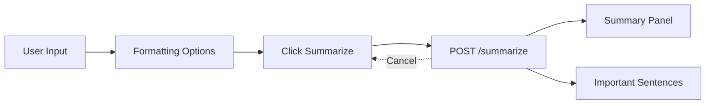

# PrimeSummarizer Frontend

PrimeSummarizer is a premium AI text-summarizing frontend built with pure HTML/CSS/JS. This document describes the current behavior of the UI, the new animated modal system, and the updated loading behavior (manual trigger via the Summarize button). Pricing selection remains removed.

Overview
- Modern minimal design with black/dark-gray palette and white accents.
- Responsive layout for desktop and mobile.
- Accessible interactions with clear feedback and non-blocking processing.
- No frameworks; optimized, lightweight assets.

Deprecated Features
- Pricing selection and the entire pricing section are removed from the UI.
- Automatic processing is deprecated. Summaries now start manually via the Summarize button.

Loading Indicator and Manual Processing
- Processing starts only when the user clicks the Summarize button.
- A loading spinner and status text appear during processing.
- Cancel is available while loading to abort the request.
- Errors show in a dedicated alert area with accessible `aria-live` feedback.

How It Works
- Formatting options can normalize whitespace, line breaks, and trimming before sending input to the API.
- Click Summarize to send a cancellable request with payload `{ "text": "USER_INPUT_TEXT" }`.
- The response is parsed into two panels: a summary and important sentences.

Active Frontend Features
- Hero section with brand logo and tagline.
- Product description with a visual process representation.
- Features cards with consistent hover glow animations.
- Summarizer UI with:
  - Large textarea for input, live character counter.
  - Formatting options (trim, normalize spaces, convert line breaks).
  - Manual processing via Summarize button with loader and Cancel action.
  - Two-column results: summary and important sentences.
  - Copy-to-clipboard actions for both results.
  - Robust error handling for API failures.

Interface Diagram (Updated)



ASCII diagram (fallback):

```
Input -> [Trim | Normalize | Unbreak] -> Click Summarize -> API -> Summary + Sentences
            ^ Cancel during processing                     Copy buttons   Errors
```

Usage Instructions
1. Open `index.html` in a browser (or serve the folder with any static server).
2. Paste or type text into the input area.
3. Click Summarize to start processing. A loader appears; use Cancel if needed.
4. Copy the summary or sentences using the Copy buttons.
5. Adjust formatting options to improve the quality of input sent to the API.

API Integration
- Endpoint is configured in `script.js` (`API_ENDPOINT`).
- Request payload: `{ "text": "<your text>" }`.
- Expected response fields:
  - `summary`: string
  - `important_sentences`: array of strings
- The frontend tolerates alternative field names such as `result`, `sentences`, or `highlights`.

Notes on Accessibility and Compatibility
- Uses `aria-live` regions for loading, errors, and counters.
- Focus-visible styles on interactive elements.
- Clipboard actions include a fallback for older browsers.
- Tested across Chrome, Firefox, and Safari compatible features.

Performance and Design
- CSS variables centralize colors, radii, and common shadows.
- Consistent hover glow across buttons and cards.
- Smooth animations for loader and entrance effects.
- Responsive breakpoints for mobile at `max-width: 768px`.

Maintenance
- To change backend endpoint, update `API_ENDPOINT` in `script.js`.
- To adjust debounce timing or minimum characters, update `DEBOUNCE_MS` and `MIN_CHARS` in `script.js`.

Changelog (UI Updates)
- Removed pricing selection section from navigation and page content.
- Restored manual Summarize workflow; loading indicator only on click.
- Added animated modal windows with accessible controls and keyboard shortcuts.

Modal Windows
- Open via the About button in the header.
- Accessible dialog with `role="dialog"`, `aria-modal`, labelled by the modal title.
- Entrance/exit animation uses opacity and transform transitions for smooth, 60fps visuals.
- Overlay click and Escape key close the dialog; focus returns to the opener.

Animation Details
- Classes: `.modal-overlay.open` and `.modal.open` enable transitions.
- Animations rely on opacity and transform to avoid layout thrash.
- Timing functions: ease transitions at ~220–240ms for subtle motion.

Loading System Details
- Loading state appears only during explicit Summarize actions.
- Cancel button aborts the current request and hides the loader.
- Errors surface in the alert area; loader is removed on failure or success.
